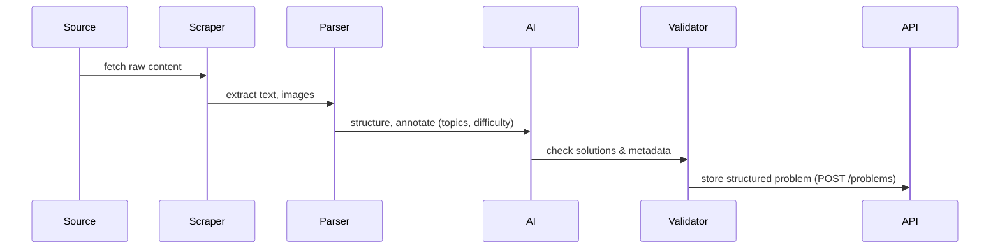

# MathBeast — AI-Powered Adaptive Math Learning Platform


**Tagline:** *Unleash your inner math beast.*

> MathBeast aggregates, structures, and teaches math with AI: adaptive learning paths, chain-of-thought solutions, semantic search, and gamified practice. (Executive summary and vision details in the project brief). 

---

## Table of contents

1. [About](#about)
2. [Key Features (tl;dr)](#key-features-tldr)
3. [Architecture — diagrams & explanations](#architecture)
4. [Processing pipeline (mermaid + diagram)](#processing-pipeline-mermaid--diagram)
5. [Data model & storage](#data-model--storage)
6. [AI stack and model choices](#ai-stack-and-model-choices)
7. [Frontend & Demo details](#frontend--demo-details)
8. [Backend & API examples](#backend--api-examples)
9. [Mock data & local demo](#mock-data--local-demo)
10. [Deployment (docker / compose)](#deployment-docker--compose)
11. [Performance targets & metrics](#performance-targets--metrics)
12. [Security, privacy & compliance](#security-privacy--compliance)
13. [Roadmap & milestones](#roadmap--milestones)
14. [Business model & go-to-market](#business-model--go-to-market)
15. [Contributing guide](#contributing-guide)
16. [License](#license)
17. [Acknowledgements & references](#acknowledgements--references)

---

# About

MathBeast is an AI-first platform designed to help learners practice and master mathematics through personalized problem recommendation, step-by-step chain-of-thought explanations, misconception detection, and adaptive learning paths. The project centers on aggregated math content, AI structuring, and a gamified learning UX. 

---

# Key features (tl;dr)

* **Dynamic problem aggregation** from textbooks, competition archives, and online resources. 
* **Chain-of-thought solution generation** (step-by-step) using an open-weight model fine-tuned for math. 
* **Adaptive intelligence core**: knowledge maps, Bayesian / Deep Knowledge Tracing, and RL-based sequencing. 
* **Semantic search & similarity** (FAISS embeddings + Elasticsearch hybrid). 
* **Teacher dashboard & classroom analytics** for educators. 
* **Mock-data-first demo flow** so you can run a convincing demo locally without infra. 

---

# Architecture

Below is a compact, production-oriented architecture diagram that illustrates the main system components: ingestion, AI processing, services, storage, and client apps.

```mermaid
flowchart LR
  subgraph Ingestion
    WebScraper[Web / Feeds / Scrapers]
    Uploads[User Uploads (images, PDFs)]
  end

  subgraph Processing
    Parser[Parsing & NLP pipeline]
    OCR[Handwritten OCR]
    Structurer[Problem Structurer]
    Embedding[Embeddings & FAISS]
    Validator[Automated Validation]
  end

  subgraph AI
    GPT[GPT-OSS-120B (fine-tuned)]
    Reranker[Answer Reranker]
    KnowledgeTrace[Knowledge Tracing Engine]
  end

  subgraph Services
    API[FastAPI / REST + WebSocket]
    AdaptEngine[Adaptation Engine]
    Analytics[Analytics Service]
    Notification[Notification Service]
  end

  subgraph Storage
    Postgres[(Postgres + Timescale)]
    Redis[(Redis Cache)]
    ES[(Elasticsearch)]
    S3[(Object Storage)]
    DW[(Data Warehouse)]
  end

  subgraph Clients
    WebApp[Next.js Web]
    Mobile[React Native / Mobile]
    TeacherUI[Teacher Dashboard]
    DevAPI[Developer API]
  end

  WebScraper --> Parser --> Structurer --> Embedding --> Validator --> Postgres
  Uploads --> OCR --> Parser
  Structurer --> GPT
  GPT --> Reranker --> API
  API --> AdaptEngine --> KnowledgeTrace
  KnowledgeTrace --> Postgres
  Embedding --> FAISS[FAISS Index]
  FAISS --> DevAPI
  API --> WebApp
  API --> Mobile
  API --> TeacherUI
  Analytics --> DW
  Notification --> Clients
```

Key notes:

* The architecture is microservices-friendly (six main services described in the spec). 
* FAISS + Elasticsearch hybrid enables both vector similarity and textual search for problem discovery. 

---

# Processing pipeline (high level)

A 6-step pipeline (visual + mermaid sequence) from raw content to API delivery:



This pipeline is implemented by combining scraping (BeautifulSoup / feed parsers), an NLP parser that tokenizes and recognizes math constructs, OCR for handwritten inputs, then an AI step that standardizes problem JSON (topic, difficulty, canonical solution, hints), followed by an automated validator that cross-checks numeric proofs or uses symbolic checks when possible. 

---

# Data model & storage (summary)

**Core DB entities**

* `Problem` — { id, source, raw_content, canonical_form, topic_tags[], difficulty, embeddings_id, created_at }
* `Solution` — { id, problem_id, steps[], rationale, confidence }
* `UserProfile`, `KnowledgeState` — per-user skill probabilities (BKT/DKT outputs)
* `Session` — tracks attempts, timestamps, hints_taken, time_spent

**Storage choices**

* PostgreSQL for normalized metadata + TimescaleDB for time-series learning traces. 
* Redis for low-latency user state. 
* FAISS (local vector index) and Elasticsearch (text) for combined search. 
* Object storage (S3-compatible) for uploads & artifacts.

---

# AI stack & model choices

**Model**: GPT-OSS-120B (open-weight), fine-tuned with LoRA for mathematical reasoning; quantization (MXFP4) used for inference optimization. Rationale: strong chain-of-thought and license friendliness. 

**Supporting ML**:

* Embeddings: SentenceTransformers for semantic similarity and FAISS index. 
* Knowledge tracing: mix of Bayesian Knowledge Tracing (BKT), Deep Knowledge Tracing (DKT), and Item Response Theory (IRT) for robust student models. 
* Misconception detection: rule-based + ML error-pattern clustering.

**Inference architecture**:

* Batched inference for throughput.
* Caching of common problem solutions and explanations via Redis.
* Reranker validates and ranks generated solutions before release. 

---

# Frontend & demo details

The repo contains a full Next.js-based prototype with:

* Live aggregation dashboard (Chart.js + MathJax). 
* Interactive demo page (quadratic solver) with hints & step reveal controls. 

**Example snippet** (rendering equation & steps):

```tsx
// useMathProblem.tsx (example)
const fetchProblem = async (id: string) => {
  const res = await fetch(`/api/problems/${id}`);
  return res.json();
};
```

Screenshots & sample visuals are in `/docs` (placeholders included). See `docs/hero.png`, `docs/architecture.png`, `docs/dashboard.png`.

---

# Backend & API examples

**Stack**: FastAPI, uvicorn, async workers, Redis, Postgres. 

**Example endpoints**

* `GET /api/v1/problems?topic=algebra&limit=20` — search problems
* `POST /api/v1/solve` — submit an attempt; returns chain-of-thought steps & hint recommendations
* `GET /api/v1/user/{id}/knowledge-map` — returns BKT/DKT state

**Example curl**

```bash
curl -X POST https://api.mathbeast.dev/api/v1/solve \
  -H "Content-Type: application/json" \
  -d '{"problem_id":"pb_1234","response":"x=2,3","user_id":"u_99"}'
```

**Backend lifecycle & example** (startup pseudocode included in repo). 

---

# Mock data & local demo

We provide a mock-data generator and an offline demo so you can demo everything without cloud GPUs. The mock generator produces realistic problem distributions, steps, and user traces. Run locally:

```bash
# generate mock data
python mock_data.py --count 1000

# start mock API
python api_mock_server.py
# open demo in browser: http://localhost:8000
```

The mock-data system and demo HTML snippets are included and were designed to produce demo-grade content for hackathons. 

---

# Deployment (docker / compose)

A `docker-compose.yml` example is included:

```yaml
version: "3.8"
services:
  db:
    image: postgres:15
    environment:
      - POSTGRES_DB=mathbeast
      - POSTGRES_USER=mathbeast
      - POSTGRES_PASSWORD=changeme
  redis:
    image: redis:7
  mathbeast-api:
    build: ./backend
    ports:
      - "8000:8000"
    environment:
      - DATABASE_URL=postgresql://mathbeast:changeme@db/mathbeast
    depends_on:
      - db
      - redis
  frontend:
    build: ./frontend
    ports:
      - "3000:3000"
    depends_on:
      - mathbeast-api
volumes:
  postgres_data:
```

(Full compose and env examples in `/deploy/docker-compose.yml`). 

---

# Performance targets & metrics

Target demo / production KPIs (guidance & targets included):

* Problems processed: **100k+** from 50+ sources. 
* Processing throughput: **~100 problems/min** (batch). 
* Solution accuracy (verified): **95%+** against curated checks. 
* API response targets: sub-2s for simple queries; up to ~10s for complex chain-of-thought generation depending on model.

---

# Security, privacy & compliance

* End-to-end encryption and secure storage for PII. 
* Privacy-first analytics (opt-in anonymous telemetry). 
* Compliance posture: prepared for **FERPA**, **COPPA**, **GDPR**; explicit opt-in for student data sharing. 

---

# Roadmap & milestones

Short-term (hackathon-friendly)

* Complete demo end-to-end with mock-data and local inference. 
* Polish teacher dashboard & reporting. 

Mid-term (months 3–12)

* Mobile apps, fine-tuning model on curated math corpus, institutional licensing features. 

Long-term

* Expand into other STEM subjects, proctored certifications, and commercial licensing. 

---

# Business model & go-to-market

Freemium consumer + institutional licensing model (pricing tiers summarized in the spec): free tier, student premium (~$9.99/mo), institutional license (~$15/student/yr). Expansion into tutor marketplace, content licensing, and certification revenue streams. 

---

# Contributing guide

We welcome contributions:

1. Fork the repo.
2. Create a feature branch: `git checkout -b feat/awesome`.
3. Run tests: `./scripts/test.sh`.
4. Submit PR with clear scope & tests.

Contributors should follow the coding standard in `/CONTRIBUTING.md`. See `docs/architecture.md` and `docs/dev-setup.md` for developer onboarding.

---

# License

This repository is released under the **Apache-2.0** license. (Model/artifact licensing may have additional terms where applicable.) 
