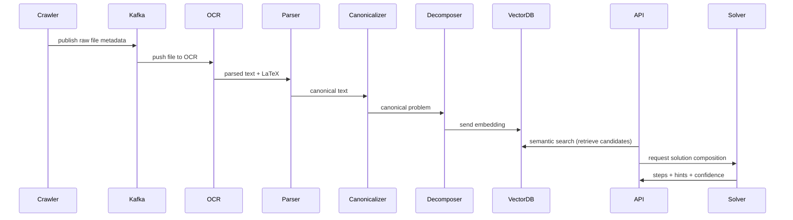

# MathBeast

**MathBeast** — an end-to-end platform that _aggregates, canonicalizes, decomposes, indexes, and serves_ structured math problems and step-by-step pedagogy for study, practice, and model training.

MathBeast turns the chaotic world of math content (textbooks, repos, forums, homework portals, videos) into _structured, pedagogy-aware_ content. The core product outputs canonical problem envelopes that include step decomposition, multi-path solutions, pedagogical tags, provenance, and quality metrics. These envelopes drive adaptive practice, teacher dashboards, dataset exports, and model training.

Primary goals:

- Find high-quality math problems and worked solutions across heterogeneous sources.
- Extract math content accurately (OCR, LaTeX extraction, math parsing).
- Canonicalize notation and deduplicate near-duplicate problems.
- Decompose into atomic steps and attach pedagogical metadata (hints, misconceptions).
- Serve via APIs for student UIs, teacher dashboards, and ML pipelines.

---

# Key features & value props

- **Heterogeneous ingestion**: crawlers for PDFs, Git repos, LMS exports, video transcripts and user uploads.
- **Math-aware extraction**: OCR + LaTeX extraction + MathML conversion + symbol normalization.
- **Canonicalization**: standardize notation, canonical variable naming, dedupe funnel.
- **Step decomposition**: produce `steps[]` with intent labels (hint, algebra step, simplification).
- **Provenance & governance**: every envelope tracks sources, timestamps, and rights metadata.
- **Quality scoring & HITL**: confidence metrics, DLQ, and human review queues.
- **Indexing & retrieval**: vector embeddings + semantic search + full-text tags.
- **Serving & outputs**: `/solve`, `/embed`, teacher dashboard, dataset export (JSONL/Parquet/TFRecord).
- **Trainable corpora**: dataset pipelines for model training with lineage and versioning.

---

# Quickstart — Local dev & Docker

## Prereqs

- Python 3.10+
- Node 18+ (for dashboard or SDK examples)
- Docker & Docker Compose
- Optional: Redis, Postgres locally or via Docker

## Clone & simple run (dev)

```bash
git clone https://github.com/lucylow/mathbeast.git
cd mathbeast

# Setup venv
python -m venv .venv
source .venv/bin/activate
pip install -r requirements.txt

# run ingestion worker (dev mode)
python -m mathbeast.ingest.cli --config local_config.yaml

# run API server
uvicorn mathbeast.api.app:app --reload --port 8000
````

## Docker (single-node dev)

```bash
# build images
docker-compose -f docker/docker-compose.dev.yml build

# start services
docker-compose -f docker/docker-compose.dev.yml up

# stop:
docker-compose -f docker/docker-compose.dev.yml down
```

Files:

* `docker/docker-compose.dev.yml` — Postgres, Redis, Vector DB stub, API, Worker, MinIO (S3-compatible).
* `Dockerfile.api` — builds the API container
* `Dockerfile.worker` — builds the ingestion/processing worker

---

# Architecture overview (diagrams)

Below are several Mermaid diagrams that map the system. You can paste these directly into GitHub Markdown (Mermaid enabled) to render visuals.

## 1) High-level flowchart (ingest → processing → serving)

```mermaid
flowchart LR
  subgraph Ingest
    A[Crawlers / Uploads] --> B[Raw Storage (S3)]
    A --> K[Message Bus (kafka)]
  end

  subgraph Preprocessing
    K --> C[OCR Service]
    K --> D[Transcript Extractor]
    C --> E[Math Parser / LaTeX Extractor]
    D --> E
  end

  subgraph CoreProcessing
    E --> F[Canonicalizer]
    F --> G[Decomposer (steps)]
    G --> H[Deduplicator]
  end

  subgraph DataPlatform
    H --> I[Staging Bucket]
    I --> J[Vectorizer -> Vector DB]
    I --> L[Postgres Metadata DB]
    L --> M[Search Index]
  end

  subgraph Serving
    J --> N[Retrieval API]
    G --> O[Solve Engine]
    O --> N
    N --> UI[Student UI / Teacher dashboard]
  end
```

## 2) Sequence diagram (ingest → solve API)



## 3) Component diagram (deployment)

```mermaid
flowchart TB
  subgraph Kubernetes Cluster
    subgraph Services
      API[API Server]
      Worker[Processing Worker]
      OCR[OCR Service (scaled)]
      Kafka[Kafka Cluster]
      Redis[Redis]
      Vector[Vector DB]
      Postgres[Postgres]
      MinIO[S3-Compatible]
      Grafana[Grafana]
      Prometheus[Prometheus]
    end
  end

  API -->|reads/writes| Postgres
  Worker --> MinIO
  Worker --> Kafka
  OCR --> MinIO
  API --> Vector
  API --> Grafana
```

---

# Data model & JSON envelope

Central unit of the platform is the **Canonical Envelope**. This is the record stored in Postgres + object references in S3 and indexed to the Vector DB.

## Example Envelope (stylized JSON)

```json
{
  "id": "mh-00012345",
  "version": "1.2.0",
  "source": {
    "origin_type": "pdf",
    "source_uri": "s3://mathbeast-raw/Calculus_Ch05.pdf",
    "page": 123,
    "offset": null
  },
  "canonical_problem": "\\int x^2 \\sin(x)\\,dx",
  "raw_problem_text": "Find the integral of x^2 sin x dx",
  "steps": [
    {
      "step_id": "s1",
      "expr": "\\text{choose } u = x^2,\\ dv = \\sin x\\,dx",
      "explanation": "Choose u to reduce polynomial degree",
      "hint": "Try integration by parts",
      "confidence": 0.93
    },
    {
      "step_id": "s2",
      "expr": "du = 2x\\,dx, v = -\\cos x",
      "explanation": "Compute du and v",
      "confidence": 0.89
    }
  ],
  "solutions": [
    { "author": "curated", "format": "LaTeX", "type": "worked", "body_ref": "s3://mathbeast-rendered/mh-00012345/solution.tex" }
  ],
  "tags": ["integration", "u-sub", "IBP", "single-variable"],
  "provenance": [
    { "publisher": "CalculusText Inc", "license": "cc-by-4.0", "fetched_at": "2025-01-10T12:23:34Z" }
  ],
  "quality": { "dedupe_score": 0.92, "confidence": 0.86 },
  "created_at": "2025-01-10T12:25:00Z",
  "updated_at": "2025-01-10T12:30:00Z"
}
```

**Notes**:

* `body_ref` points to S3/MinIO object for larger content (PDF snippets, rendered images, large LaTeX).
* `confidence` fields are used to determine HITL routing thresholds.

---

# Ingestion pipeline (detailed)

The ingestion pipeline is responsible for collecting raw inputs, performing early extraction and creating parse artifacts.

## Sources

* PDFs & scanned pages
* Git/GitHub repos (ex: open content)
* Q&A forums (Stack-style scraping)
* Video transcripts & caption files (YouTube, Vimeo)
* LMS exports and homework portals
* Direct user uploads (teacher/student)

## Components

1. **Crawlers / Connectors** — scheduled / on-demand fetchers. They must:

   * Respect robots.txt and rate limits
   * Record provenance metadata
   * Produce signed URLs for large files (S3 pre-signed)
2. **Raw Storage** — S3/MinIO for raw assets.
3. **Message Bus** — Kafka topics (`raw-ingest`, `ocr-parsed`, `math-parsed`) to decouple producers and consumers.
4. **OCR Stack** — PaddleOCR / Tesseract (multi-model selection), with layout detection (table/cell extraction). Output: OCR JSON + position coordinates.
5. **Transcript extractor** — consolidate subtitle cues with time offsets.
6. **Math Parser / LaTeX Extractor** — tries to:

   * Detect LaTeX blocks using regex heuristics
   * Convert inline math to LaTeX
   * Use Mathpix-like service or local models for handwritten conversion (where allowed)
7. **Preprocessor** — normalizes whitespace, Unicode characters, and basic symbol mappings.

## Example ingestion pseudo-code (Python)

```python
def ingest_file(s3_uri):
    manifest = fetch_manifest(s3_uri)
    publish_to_kafka("raw-ingest", manifest)
```

---

# Canonicalization & decomposition

This is the heart of MathBeast's pedagogy-aware processing.

## Canonicalization steps

* Normalize whitespace and symbol variants (e.g., `sin^{-1}` → `arcsin` mapping, or vice versa depending on canonical choice)
* Standardize variable names (x1, x2 → x) while preserving mapping in `canonical_to_raw_map`
* Normalize function names and delimiters (e.g., consistent use of `\,` for spacing)
* Collapse trivial algebraic differences (e.g., `2*(x)` → `2x` if semantics preserved)

### canonicalizer pseudo:

```python
def canonicalize(latex_str):
    # parse into AST (sympy / custom parser)
    ast = parse_math(latex_str)
    ast = normalize_symbols(ast)           # variable renaming
    ast = canonicalize_functions(ast)      # sin/cos rules
    return ast.to_latex()
```

## Decomposition (step inference)

* Use sequence labeling (Transformer / BiLSTM / CRF) to place step boundaries.
* Combine model suggestions with deterministic heuristics (IBP candidate heuristics, pattern-based algebra steps).
* Each step includes:

  * `expr` (LaTeX)
  * `explanation` (human-readable)
  * `hint` (short hint)
  * `confidence` score

**Example rule**: Detect `∫` with polynomial × trig → suggest IBP, emit a `hint` recommending IBP.

## Deduplication

* Vector similarity + MinHash / SimHash to find near-duplicates.
* Merge policy: keep highest-quality envelope and append alternate provenance references.

---

# Solve & Explain subsystem

The Solve Engine composes solutions using a hybrid approach:

* **Rule-based deterministic path** for standard problems (algebraic simplifications, substitution, common integrals).
* **Neural solvers** for complex multi-step reasoning / unusual forms (kept for cases >= confidence threshold).
* **Post-processing** ensures numeric simplifications, constant of integration handling, and step normalization.

### APIs expected from solver:

* `POST /solve` with `problem_id` or `canonical_problem`
* Options: `max_steps`, `preferred_strategy` (symbolic / neural / hybrid)
* Response: `steps[]`, `hints[]`, `confidence`, `alternate_solutions[]`

### Example response snippet:

```json
{
  "id":"mh-00012345",
  "steps":[
    {"step_id":"s1","expr":"u=x^2","explanation":"choose u","confidence":0.93},
    {"step_id":"s2","expr":"du=2x dx","explanation":"differentiate u","confidence":0.89}
  ],
  "confidence":0.91,
  "alternates":[
    {"method":"trigsu","confidence":0.65}
  ]
}
```

---

# Indexing, retrieval, and dataset exports

## Vector embeddings

* Encoder model (e.g., SBERT variants or embedding models) encodes `canonical_problem`, steps and explanations.
* Vectors stored in Vector DB (Milvus/Pinecone/FAISS) with metadata linking back to canonical envelopes.

## Search indexing

* Elasticsearch/Opensearch used for full-text queries and tag-based filters (curriculum, difficulty).

## Dataset export

* Exports are generated per dataset version and stored as JSONL, Parquet, or TFRecord. Each export includes:

  * Canonical JSON envelopes
  * Provenance and license metadata
  * Versioned manifest (SHA256 checksums)

## Example dataset export command

```bash
python -m mathbeast.dataset.export --since 2025-01-01 --min_confidence 0.85 --out dataset_v1.jsonl
```

---

# APIs & example calls

## Authentication

* OAuth2 for user-facing dashboards
* API Keys or JWT for partners

## Endpoints (examples)

* `GET /health` — health check
* `POST /ingest` — submit new asset URL / upload manifest
* `GET /problems/{id}` — fetch canonical envelope
* `GET /solve?problem_id=<id>` — returns steps & hints
* `POST /embed` — returns embedding vector for supplied text

### Example: solve API

Request:

```
GET /solve?problem_id=mh-00012345
Authorization: Bearer <token>
```

Response:

```json
{
  "id": "mh-00012345",
  "steps": [
    {"expr": "\\int x^2 \\sin(x)\\,dx", "explanation": "Integration by parts candidate", "confidence": 0.93},
    {"expr": "-x^2 \\cos x + 2\\int x \\cos x\\,dx", "explanation": "apply IBP", "confidence": 0.89}
  ],
  "confidence": 0.91
}
```

### Example: embed API (curl)

```bash
curl -X POST https://api.mathbeast.ai/embed \
  -H "Authorization: Bearer $API_TOKEN" \
  -H "Content-Type: application/json" \
  -d '{"text":"\\int x^2 \\sin(x) dx"}'
```

---

# Model training & CI/CD for models

## Overview

* Data from dataset exports is fed into training pipelines (Kubeflow/TFX/Airflow).
* Model Registry: MLflow / ModelDB for versioning.
* Test suite for models: unit tests (sanity checks), correctness tests (known problem set with gold steps), adversarial tests.

## Pipeline skeleton (Airflow DAG / pseudo)

```python
with DAG(...) as dag:
    extract = PythonOperator(task_id='extract', ...)
    preprocess = PythonOperator(task_id='preprocess', ...)
    train = KubernetesPodOperator(task_id='train', image='mathbeast/trainer:latest')
    validate = PythonOperator(task_id='validate', ...)
    register = PythonOperator(task_id='register', ...)
    deploy = KubernetesPodOperator(task_id='deploy', ...)
```

## CI/CD

* Push to `main` triggers unit tests and static checks.
* Merge to `release` triggers integration tests and builds Docker images.
* Model deployment uses canary releases with validation metrics (accuracy & hallucination checks).

---

# Deployment & infra (K8s / Helm / Terraform)

## Recommended components

* **Kubernetes** cluster (GKE / EKS / AKS) or managed k8s
* **Ingress**: NGINX or cloud load balancer
* **Service Mesh**: Istio/Linkerd (optional for advanced telemetry)
* **Message Bus**: Kafka (Strimzi) or Pub/Sub
* **Object Storage**: S3 (or MinIO for on-prem)
* **Postgres** (managed or stateful k8s)
* **Vector DB**: Milvus or Pinecone
* **Monitoring**: Prometheus + Grafana + Loki
* **CI/CD**: GitHub Actions + Helm charts

## Example Helm/values snippet (api chart)

```yaml
replicaCount: 3
image:
  repository: ghcr.io/mathbeast/api
  tag: v1.2.0
resources:
  limits:
    cpu: 1
    memory: 2Gi
ingress:
  enabled: true
  host: api.mathbeast.example
```

## Terraform notes

* Use Terraform modules for clustered infra (VPC, subnets, k8s BE).
* Store secrets in Secret Manager (GCP) / AWS Secrets Manager.

---

# Monitoring, observability & SLOs

## Suggested SLOs

* Retrieval API latency (fast path): 95th percentile < 300ms
* API availability: 99.5%
* Worker throughput: X items / minute (configurable)

## Telemetry

* Metrics: Prometheus metrics for request latency, worker queue depth, OCR error rate, model inference time.
* Logs: centralized (Loki/ELK), structured JSON logs (include request_id).
* Traces: OpenTelemetry instrumentation across services.

## Sample Prometheus metrics (Python)

```python
from prometheus_client import Gauge, Histogram
request_time = Histogram('api_request_duration_seconds', 'API request latency')
```

---

# Quality assurance & HITL workflow

## Confidence thresholds

* `confidence >= 0.9` — auto-publish to dataset
* `0.6 <= confidence < 0.9` — mark for spot review / sample audit
* `confidence < 0.6` — route to HITL queue

## HITL queue

* Teachers or domain experts review items in a `Teacher Review UI`.
* Reviews generate labels / corrections which are fed back for retraining.

## Unit & integration testing

* Unit tests: extraction utilities, canonicalizer rules, parser
* Integration tests: ingest sample PDF → generate canonical envelope → solve → compare to gold outputs
* Use `pytest` and test fixtures with deterministic seeds for small models/heuristics

---

# Dataset governance, licensing & privacy

## Provenance & license tracking

* Each source must include license metadata (CC-BY, CC0, publisher license).
* If license disallows redistribution, mark envelope `shareable:false` and do not include in public exports.

## Opt-out & takedown workflow

* Maintain `takedown_requests` table and enforce removal from exports and indices within SLA (e.g., 72 hours).

## Privacy & PII

* Strip/flag any user-submitted data that contains PII.
* Follow applicable laws (GDPR/CCPA) for user data retention and requests.

---

# Performance & scaling notes

## Bottlenecks to monitor

* OCR throughput & worker concurrency
* Vector DB indexing (rebuilds can be expensive)
* Model inference latency on GPU instances

## Scaling strategies

* Use autoscaling node pools for inference (GPU-backed) and CPU pools for workers.
* Partition Kafka topics by source type and use consumer groups for parallelism.
* Batch small items for vectorization to improve GPU utilization.

---

# Roadmap & milestones (short)

* v0.1: Core ingestion + canonicalizer + retrieval API
* v0.2: Decomposer + Solve Engine (rule-based)
* v0.3: Embeddings + Vector DB integration + teacher review UI
* v1.0: Public dataset release (50k+ problems), pilot schools integration

---

# Contributing, code style & tests

## Contributing guidelines

* Fork, feature branch `feature/<name>`, open PR to `develop`.
* PRs must include tests and a short description.
* Follow commit convention: `fix:`, `feat:`, `chore:`, `docs:`.

## Code style

* Python: PEP8 via `black` + `ruff`
* JS/TS: `prettier` + `eslint`
* Docker images: small base images, multi-stage builds

## Tests

```bash
# run unit tests
pytest tests/unit

# run integration tests (development)
pytest tests/integration --slow
```

---

# Troubleshooting & FAQ

## Q: OCR outputs garbage for scanned content — what to do?

* Try training or swapping OCR model (PaddleOCR may outperform Tesseract for certain languages).
* Pre-process images: deskew, denoise, enhance contrast.

## Q: Vector DB search returns noisy near-duplicates

* Increase dedupe threshold.
* Add pass using MinHash to block true-duplicates before vector indexing.

## Q: Solver hallucinates solutions

* Increase confidence threshold for auto-publish.
* Add unit-tests for common domains (algebra & calculus).
* Route low-confidence outputs to HITL queue.

---

# Example files & code snippets (useful)

## Example Dockerfile (API)

```dockerfile
FROM python:3.10-slim
WORKDIR /app
COPY pyproject.toml poetry.lock /app/
RUN pip install poetry && poetry config virtualenvs.create false && poetry install --no-dev
COPY . /app
CMD ["uvicorn", "mathbeast.api.app:app", "--host", "0.0.0.0", "--port", "8080"]
```

## Example Kubernetes manifest (Deployment fragment)

```yaml
apiVersion: apps/v1
kind: Deployment
metadata:
  name: mathbeast-api
spec:
  replicas: 3
  selector:
    matchLabels:
      app: mathbeast-api
  template:
    metadata:
      labels:
        app: mathbeast-api
    spec:
      containers:
      - name: api
        image: ghcr.io/mathbeast/api:latest
        resources:
          limits:
            cpu: "1"
            memory: "2Gi"
        envFrom:
          - secretRef:
              name: mathbeast-secrets
```

---

# License & contact

* MathBeast repository: [https://github.com/lucylow/mathbeast](https://github.com/lucylow/mathbeast)
* Demo site: [https://v0-mathbeast.vercel.app/](https://v0-mathbeast.vercel.app/)

**License**: Choose an appropriate license (e.g., MIT for code; separate license for datasets and content exports). If you plan to publish training data, confirm source license compatibility (CC-BY, CC0, publisher agreements).

**Maintainers / Contact**: Open an issue in the GitHub repo for questions, or open a PR for contributions.

---

# Appendices

## Appendix A — Example test vector for canonicalizer

```python
def test_canonicalize_polynomial_times_trig():
    src = "∫ x^2 sin x dx"
    out = canonicalize(src)
    assert "\\int x^2 \\sin(x)\\,dx" in out
```

## Appendix B — Sample exporter config (Parquet)

```yaml
export:
  format: parquet
  compression: snappy
  min_confidence: 0.85
  include_provenance: true
```

## Appendix C — Recommended SRE runbook summary

* On Kafka lag > 10k for 2+ minutes: scale consumers + inspect failing items.
* On Vector DB OOM: reduce index rebuild concurrency, scale node pool.
* On elevated solver latency: route to rule-based fast path or scale GPU pool.

```

